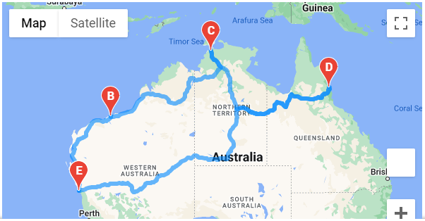

# World_Weather_Analysis

## Overview of the Analysis:
- The purpose of this analysis is to help improve the PlanMyTrip app allowing the user to input their desired weather preferences to filter and identify potential travel destinations and nerby hotels.
- From the list of potential travel destinations the beta tester will be able to choose four cities to create a travel itinerary and travel route using Google Maps Directions API.

 

 

## Deliverable 1: Retrieve Weather Data

 

## Deliverable 2: Create a Customer Travel Destinations Map

 

## Deliverable 3: Create a Travel Itinerary Map

 

